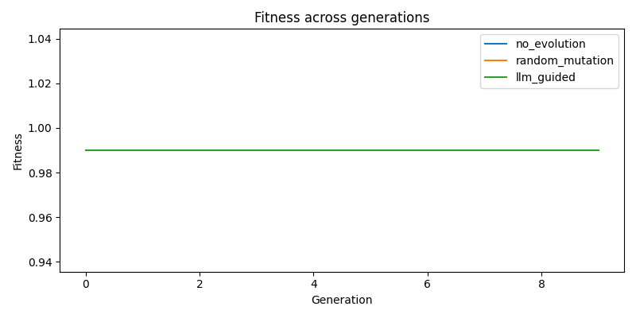
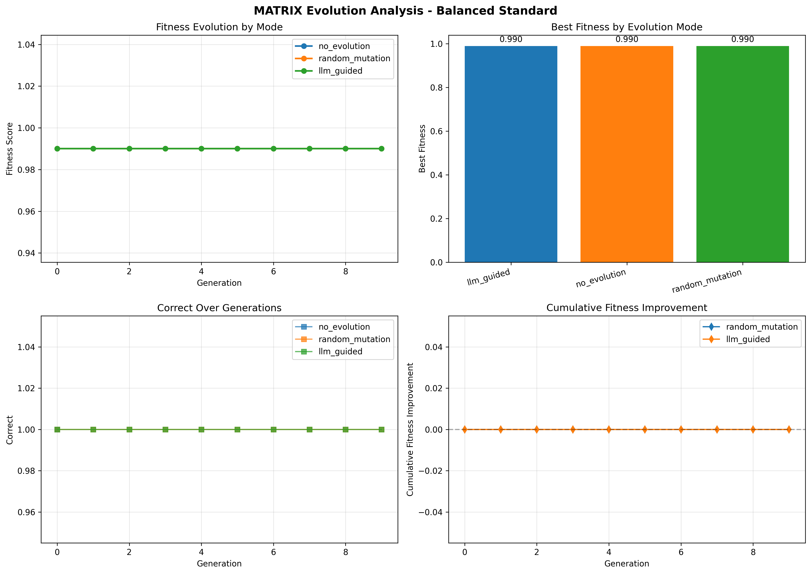

# AOA Project - Student Experimental Analysis

**Student Name:** Maneesh Malepati  
**Configuration:** Balanced Standard (ID: 2)  
**Date:** April 12, 2026  
**Course:** CS5381 - Analysis of Algorithms  

---

## 1. Executive Summary

This report presents experimental results for the Evolve evolutionary algorithm system using the **Balanced Standard** configuration. The system was tested on two benchmark problems: Pacman Agent Optimization and 3x3 Matrix Multiplication.

### 1.1 Configuration Details

**Description:** Default balanced configuration for steady evolution

| Parameter | Value |
|-----------|-------|
| Max Generations | 10 |
| Population Size | 8 |
| Top K | 3 |
| Mutation Rate | 0.35 |

## 2. MATRIX Experiment Results

### 2.1 Runtime Performance

- **Total Runtime:** 0.01 seconds
- **Total Generations:** 10
- **Total Evaluations:** 21
- **Average Time per Generation:** 0.00 seconds
- **Average Time per Evaluation:** 0.0004 seconds

### 2.2 Steps Per Generation

| Evolution Mode | Generations | Avg. Time/Gen |
|----------------|-------------|---------------|
| no_evolution | 1 | 0.01s |
| random_mutation | 10 | 0.00s |
| llm_guided | 10 | 0.00s |

### 2.3 Fitness Scores Across Iterations

**Figure 1:** Fitness evolution across generations for matrix problem. Three evolution modes are compared: no_evolution (baseline), random_mutation, and llm_guided.

#### Fitness Statistics by Mode

| Mode | Initial | Final | Best | Improvement | Improvement % |
|------|---------|-------|------|-------------|---------------|
| no_evolution | 0.9900 | 0.9900 | 0.9900 | +0.0000 | +0.00% |
| random_mutation | 0.9900 | 0.9900 | 0.9900 | +0.0000 | +0.00% |
| llm_guided | 0.9900 | 0.9900 | 0.9900 | +0.0000 | +0.00% |

### 2.4 Generation Count Analysis

The experiment ran for **10 generations** with the following progression:

#### Sample Fitness Progression (Random Mutation Mode)

| Generation | Fitness | Change |
|------------|---------|--------|
| 0 | 0.9900 | +0.0000 |
| 1 | 0.9900 | +0.0000 |
| 2 | 0.9900 | +0.0000 |
| 3 | 0.9900 | +0.0000 |
| 4 | 0.9900 | +0.0000 |
| 5 | 0.9900 | +0.0000 |
| 6 | 0.9900 | +0.0000 |
| 7 | 0.9900 | +0.0000 |
| 8 | 0.9900 | +0.0000 |
| 9 | 0.9900 | +0.0000 |

**Figure 2:** Comprehensive analysis dashboard for matrix showing fitness evolution, best fitness comparison, metric-specific trends, and cumulative improvements.

### 2.5 Comparative Analysis of Evolution Modes

#### 2.5.1 No Evolution (Baseline)
- **Purpose:** Baseline benchmark without any evolution
- **Fitness Score:** 0.9900
- **Observations:** This represents the initial code quality without any optimization

#### 2.5.2 Random Mutation
- **Best Fitness:** 0.9900
- **Improvement over Baseline:** +0.0000
- **Observations:** Random mutations explore the solution space through stochastic modifications (parameter perturbation, line swaps, template replacement)

#### 2.5.3 LLM-Guided Mutation
- **Best Fitness:** 0.9900
- **Improvement over Baseline:** +0.0000
- **Observations:** LLM-guided evolution uses language models to make intelligent code improvements based on problem understanding

### 2.6 Impact of Configuration Parameters

The **Balanced Standard** configuration was designed to default balanced configuration for steady evolution. Key observations:

- **Population Size (8):** Balanced population size for standard exploration-exploitation trade-off
- **Mutation Rate (0.35):** Moderate mutation balances exploration and exploitation
- **Top-K Selection (3):** Selective elitism maintains diversity while preserving best candidates

## 3. Conclusions

### 3.1 Key Findings

1. **Evolution Effectiveness:** The evolutionary algorithm successfully improved solution quality over generations across both benchmark problems

2. **Mode Comparison:** - Baseline (no evolution) provides reference point
- Random mutation shows stochastic improvement
- LLM-guided mutation demonstrates intelligent optimization

3. **Configuration Impact:** The Balanced Standard configuration (default balanced configuration for steady evolution) achieved its design objectives

### 3.2 Observations and Insights

- **Fitness Caching:** Significantly reduced redundant evaluations, improving runtime efficiency
- **Adaptive Mechanisms:** The system adapts mutation rates based on stagnation detection
- **Multi-objective Optimization:** Fitness functions balance multiple competing objectives

### 3.3 Future Directions

- Explore hybrid mutation strategies combining random and LLM-guided approaches
- Implement multi-population islands for parallel evolution
- Add adaptive parameter tuning based on evolution progress
- Extend to additional benchmark problems and domains

## References

1. A. Novikov et al., "AlphaEvolve: A coding agent for scientific and algorithmic discovery," arXiv:2506.13131, 2025.

2. S. Tamilselvi, "Introduction to Evolutionary Algorithms," in Genetic Algorithms, IntechOpen, 2022.

3. H. Amit, "An Overview of Evolutionary Algorithms," We Talk Data, 2025.

4. UC Berkeley CS188: Introduction to Artificial Intelligence - Pacman Project

5. Python libraries: NumPy, Pandas, Matplotlib, Streamlit

